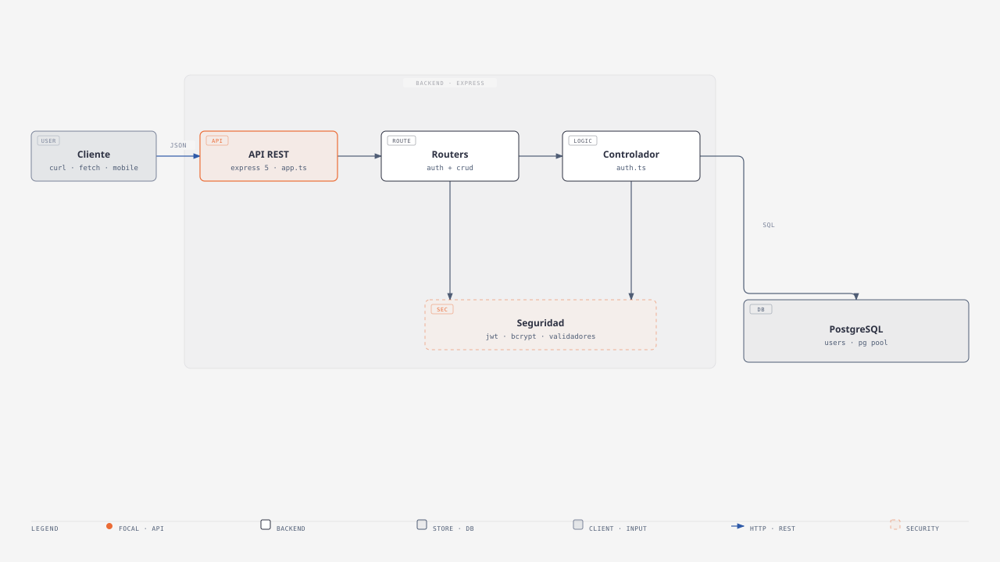
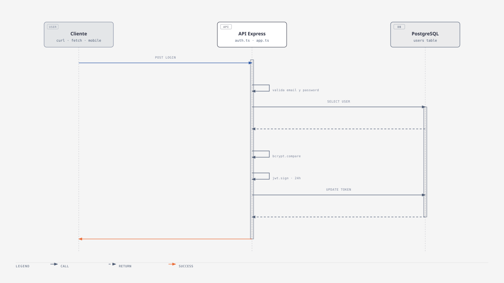
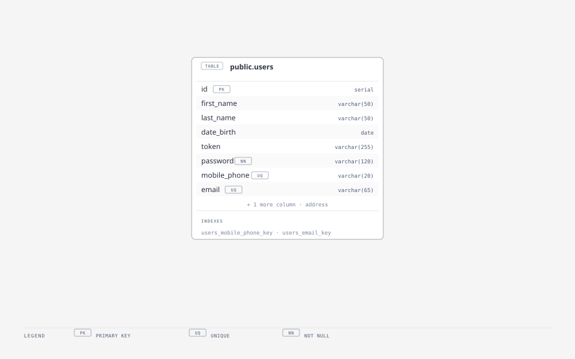

# JR Backend Technical Test — Gestión de Usuarios

Backend de gestión de usuarios construido con **TypeScript**, **Express 5** y **PostgreSQL**: autenticación con **JWT**, gestión de sesiones por *cookie httpOnly*, operaciones **CRUD** completas y validación de contraseñas con **bcrypt**.


---

## Tabla de contenidos

1. [Descripción](#-descripcion)
2. [Arquitectura](#arquitectura)
3. [Funcionalidades](#funcionalidades)
4. [Flujo de autenticación](#flujo-de-autenticacion)
5. [Base de datos](#base-de-datos)
6. [Estructura del proyecto](#estructura-del-proyecto)
7. [Requisitos previos](#requisitos-previos)
8. [Instalación y configuración](#instalacion-y-configuracion)
9. [Variables de entorno](#variables-de-entorno)
10. [Scripts](#scripts)
11. [Endpoints de la API](#endpoints-de-la-api)
12. [Tests](#tests)
13. [Conexión con Fetch](#conexion-con-fetch)
14. [Seguridad](#seguridad)
15. [Dependencias](#dependencias)
16. [Diagramas fuente](#diagramas-fuente)
17. [Licencia](#licencia)

---

## Descripción

API REST para alta, consulta, actualización y borrado de usuarios sobre PostgreSQL. Implementa un flujo de autenticación por **token JWT (expiración 24 h)** que se entrega en una cookie `httpOnly` y en el cuerpo de la respuesta, y protege las operaciones sensibles mediante un middleware de validación (cookie `access_token` o header `Authorization: Bearer`).

**En pocas palabras:**

| Capacidad | Detalle |
| --- | --- |
| Login | `mobile_phone` + `password`, JWT de 24 h, cookie `httpOnly` |
| Registro | `signup` protegido por token, sin exponer la contraseña |
| CRUD | Crear, leer (por ID y listado), actualizar y eliminar usuarios |
| Persistencia | PostgreSQL con pool de conexiones (`pg`) y SQL parametrizado |
| Validación | Manual por capas (`validators.ts`) + middleware JWT |
| Encriptación | bcrypt (15 rounds) para hash y comparación de contraseñas |

---

## Arquitectura



La petición entra por **Express** (`app.ts`), pasa por el stack de middleware (CORS, *morgan*, *cookie-parser*, `express.json`) y es despachada por los routers hacia el controlador. El controlador valida la entrada, encripta contraseñas y persiste vía el pool de `pg`.

| Capa | Archivo | Responsabilidad |
| --- | --- | --- |
| Cliente | — | `curl`, `fetch` o cliente móvil; autentica y consume la API |
| API REST | `src/app.ts` | Configura middleware, rutas, 404 y error handler global |
| Routers | `src/router/*.ts` | Expone las rutas `/api/v1/users` y aplica el middleware de token |
| Controlador | `src/controller/auth.ts` | Lógica de negocio: registro, login, CRUD y sanitización de respuestas |
| Seguridad | `src/utils/*.ts` | JWT, bcrypt y validación manual de entrada |
| Datos | `src/models/db.ts` | Pool de conexiones a PostgreSQL y `Query` tipada |

> **Foco del diagrama:** la capa de seguridad (JWT · bcrypt · validadores) es compartida por routers y controlador; el acceso a datos siempre ocurre a través de SQL parametrizado sobre `public.users`.

---

## Funcionalidades

### Autenticación

- **Inicio de sesión**: valida `mobile_phone` + `password`, firma un JWT (`expiresIn: "24h"`) y lo entrega en la cookie `access_token` (`httpOnly`, `sameSite: strict`, `secure` en producción) y en el cuerpo de la respuesta (`accesss_token: "bearer"`).
- **Validación de token**: middleware que acepta la cookie `access_token` o el header `Authorization: Bearer <token>`; rechaza con **401** si falta o si el token es inválido o expirado.

### Gestión de usuarios (CRUD)

- **Crear usuario** (`signup`): requiere token. Valida campos, rechaza **409** si el email ya existe, hashea la contraseña y responde **sin incluir la contraseña**.
- **Leer usuarios**: listado completo (`GET /api/v1/users`, público) y consulta por ID (`GET /api/v1/users/:id`, protegida).
- **Actualizar usuario**: actualiza solo los campos permitidos; si se envía `password`, se vuelve a hashear.
- **Eliminar usuario**: borra el registro y responde **sin exponer la contraseña**.

### Respuesta pública (`PublicUser`)

Toda respuesta de usuario omite `password` y `token`; las fechas se normalizan a `YYYY-MM-DD` mediante `toPublicUser`.

---

## Flujo de autenticación



1. El cliente envía **`POST /api/v1/users/login`** con `mobile_phone` y `password`.
2. La API valida los campos enviados (`validators.ts`).
3. Se consulta el usuario por `mobile_phone` en PostgreSQL.
4. Se compara la contraseña contra el hash con **bcrypt**.
5. Se firma el **JWT** (payload: nombre, email y teléfono) con expiración de 24 h.
6. El token se persiste en la columna `token` y se devuelve **200** con la cookie `httpOnly` + el token en el cuerpo.
7. En rutas protegidas, el cliente reenvía la cookie o el header `Authorization: Bearer`.

---

## Base de datos



El esquema vive en `src/models/db.sql`. La tabla `users` incluye un usuario de prueba (bcrypt de `"123456"`):

| Usuario de prueba | Valor |
| --- | --- |
| `mobile_phone` | `1234567890` |
| `password` | `123456` |
| `email` | `johndoe@example.com` |

> **Migración para bases existentes:** si el esquema previo tenía la columna con el *typo* `addres`, ejecuta:
> ```sql
> alter table users rename column addres to address;
> ```

---

## Estructura del proyecto

```
.
├── config.ts                  # Configuración (env, puerto, conexión BD, JWT)
├── package.json
├── tsconfig.json
├── templated.env              # Plantilla de variables de entorno
├── src/
│   ├── app.ts                 # App Express: middleware, rutas, 404 y errores
│   ├── run.ts                 # Arranque del servidor en el puerto configurado
│   ├── controller/
│   │   └── auth.ts            # Login, signup y CRUD; respuesta sin password
│   ├── models/
│   │   ├── db.sql             # DDL de la tabla users + usuario de prueba
│   │   └── db.ts              # Pool de PostgreSQL y Query tipada
│   ├── router/
│   │   ├── authRouter.ts      # POST /login, POST /signup (protegido)
│   │   └── crudRouter.ts      # GET /users, GET/:id, PUT/:id, DELETE/:id
│   └── utils/
│       ├── encrypt.ts         # bcrypt: hash y comparación
│       ├── validation.ts      # Middleware de validación de token JWT
│       └── validators.ts      # Validación manual de signup/login/update
├── test/
│   └── app.test.js            # Suite con Supertest (requiere BD)
├── test_HTTP-client/
│   ├── postman_client/        # Colección para Postman
│   └── thumder_client/        # Colección para Thunder Client
└── docs/
    └── diagrams/              # Diagramas (SVG + HTML autocontenidos)
```

### Archivos clave

| Archivo | Descripción |
| --- | --- |
| `config.ts` | Valida y expone la configuración; **falla al arrancar** si faltan `SECRET_TOKEN` o la cadena de BD correcta para el entorno. |
| `src/app.ts` | Configura CORS (origin dinámico según entorno), logging, cookies y JSON; maneja 404 y error handler global (500). |
| `src/controller/auth.ts` | Lógica de autenticación y CRUD; nunca devuelve `password`/`token` en las respuestas. |
| `src/models/db.ts` | `Pool` de `pg` con `ssl` automático en producción y `Query` tipada que propaga errores. |
| `src/utils/validation.ts` | Middleware `validationToken`: extrae token de cookie o `Authorization: Bearer`, lo verifica y rellena `req.session`. |
| `src/utils/validators.ts` | Validación manual (`validateSignup`, `validateLogin`, `validateUpdate`) y lista `UPDATABLE_FIELDS`. |

---

## Requisitos previos

- [PostgreSQL](https://www.postgresql.org/download/) instalado y accesible (en `PATH`).
- Node.js 18+ (módulos ESM, `"type": "module"`).

---

## Instalación y configuración

1. Instala PostgreSQL y agrégalo al PATH.
2. Instala las dependencias:
   ```bash
   npm install
   ```
3. Crea tu `.env` a partir de `templated.env` con al menos `DB_LOCAL` y `SECRET_TOKEN`:
   ```bash
   cp templated.env .env
   ```
4. Ejecuta `src/models/db.sql` para crear la tabla `users` (y aplica la migración indicada si partías del esquema viejo).
5. Compila TypeScript:
   ```bash
   npm run build
   ```
6. Arranca el servidor:
   ```bash
   npm run dev        # desarrollo (tsc + nodemon, watch)
   npm run build && npm start   # producción
   ```

---

## Variables de entorno

| Variable | Requerida | Descripción |
| -------- | --------- | ----------- |
| `DB_LOCAL` | Sí (dev) | Cadena de conexión a la BD local (desarrollo). |
| `DB_CLOUD` | Sí (prod) | Cadena de conexión a la BD en la nube (producción). |
| `NODE_ENV` | No | `Production` selecciona BD en la nube y cookie `secure`. |
| `RUN_SERVER` | No | Puerto del servidor (por defecto `3000`). |
| `SECRET_TOKEN` | **Sí** | Secreto para firmar los JWT. La app **falla al arrancar** si falta. |
| `APP_PROTOCOL` / `APP_UNIQUE_NAME` / `APP_DONMAIN` | Solo prod | Forman la URL de producción usada como origen CORS. |

**Reglas de validación de `config.ts`:**

- Falta `SECRET_TOKEN` → error al arrancar.
- `NODE_ENV !== 'Production'` y falta `DB_LOCAL` → error al arrancar.
- `NODE_ENV === 'Production'` y falta `DB_CLOUD` → error al arrancar.

---

## Scripts

| Script | Descripción |
| ------ | ----------- |
| `npm run dev` | Compila y ejecuta con nodemon (watch). |
| `npm run build` | Compila TypeScript a `dist/` (`tsc`). |
| `npm run typecheck` | Verifica tipos sin emitir (`tsc --noEmit`). |
| `npm test` | Compila (`pretest`) y ejecuta la suite con Jest. |

---

## Endpoints de la API

> Convención: los endpoints marcados como **[Seguridad]** requieren token (cookie `access_token` o header `Authorization: Bearer`).

| Método | Ruta | Protegido | Descripción |
| ------ | ---- | --------- | ----------- |
| POST | `/api/v1/users/login` | No | Inicia sesión con `mobile_phone` y `password`. |
| POST | `/api/v1/users/signup` | Sí | Crea un nuevo usuario. |
| GET | `/api/v1/users` | No | Recupera todos los usuarios. |
| GET | `/api/v1/users/:id` | Sí | Recupera un usuario por ID. |
| PUT | `/api/v1/users/:id` | Sí | Actualiza un usuario por ID. |
| DELETE | `/api/v1/users/:id` | Sí | Elimina un usuario por ID. |

### Cuerpos de solicitud

**Login**

```json
{ "mobile_phone": "5551234567", "password": "123456" }
```

**Signup**

```json
{
  "first_name": "Juan",
  "last_name": "Perez",
  "date_birth": "1990-01-01",
  "mobile_phone": "5551234567",
  "email": "juan.perez@example.com",
  "password": "123456",
  "address": "Calle Falsa 123"
}
```

**Update** — campos permitidos: `first_name`, `last_name`, `date_birth`, `address`, `password`, `mobile_phone`, `email`. Si se envía `password`, se hashea antes de persistir.

---

## Tests

La suite (`test/app.test.js`) usa **Supertest** contra la app compilada.

> Requisito: una base PostgreSQL en ejecución y un `.env` configurado con la conexión y `SECRET_TOKEN`. Algunos tests mutan la tabla `users` (renombrado temporal a `users_temp_test`) para forzar el error 500, y la restauran al final.

```bash
npm test
```

Cubre: login correcto/incorrecto/usuario inexistente, creación con 201/409/400, listado y consulta por ID, 401 sin token, `PUT` con campos válidos e inválidos, y borrado con sus casos de error.

---

## Conexión con Fetch

### Login

```javascript
fetch('https://tu-dominio.com/api/v1/users/login', {
  method: 'POST',
  headers: { 'Content-Type': 'application/json' },
  body: JSON.stringify({ mobile_phone: '5551234567', password: '123456' }),
})
  .then((res) => res.json())
  .then((data) => console.log(data.accesss_token));
```

### Crear usuario (requiere token)

```javascript
fetch('https://tu-dominio.com/api/v1/users/signup', {
  method: 'POST',
  headers: {
    'Content-Type': 'application/json',
    Authorization: 'Bearer TU_TOKEN',
  },
  body: JSON.stringify({
    first_name: 'Juan',
    last_name: 'Perez',
    date_birth: '1990-01-01',
    mobile_phone: '5551234567',
    email: 'juan.perez@example.com',
    password: '123456',
    address: 'Calle Falsa 123',
  }),
});
```

### Obtener todos los usuarios

```javascript
fetch('https://tu-dominio.com/api/v1/users')
  .then((res) => res.json())
  .then((data) => console.log(data.getAllUsers));
```

---

## Seguridad

- **Contraseñas**: hash con bcrypt, 15 rounds (`encrypt.ts`). Nunca se devuelven en las respuestas.
- **Tokens**: JWT firmados con `SECRET_TOKEN`, expiración de 24 h.
- **Cookies**: `httpOnly` (inaccesibles para JS del cliente), `sameSite: strict` y `secure` en producción.
- **SQL**: todas las consultas usan parámetros (`$1, $2, …`) sobre el pool de `pg`.
- **CORS**: restringido al origen dinámico (`localhost` en desarrollo, URL de despliegue en producción).
- **Validación**: entrada validada antes de tocar la BD; errores devueltos como `400` con detalle en `errors`.

---

## Dependencias

**Producción:** `express`, `pg`, `bcrypt`, `jsonwebtoken`, `cookie-parser`, `cors`, `morgan`, `dotenv`, `nodemon`.

**Desarrollo:** `typescript`, `ts-node`, `jest`, `supertest`, `ts-jest`, `cross-env` y sus tipos (`@types/*`).

---

## Diagramas fuente

Los diagramas del README están también disponibles como archivos **HTML autocontenidos** (SVG inline, edición directa en cualquier navegador):

| Diagrama | Archivo |
| --- | --- |
| Arquitectura | `docs/diagrams/architecture.html` |
| Secuencia de login | `docs/diagrams/sequence.html` |
| Esquema de BD | `docs/diagrams/db-schema.html` |

Versiones portables (SVG standalone): `docs/diagrams/*.svg`.

---

## Licencia

ISC